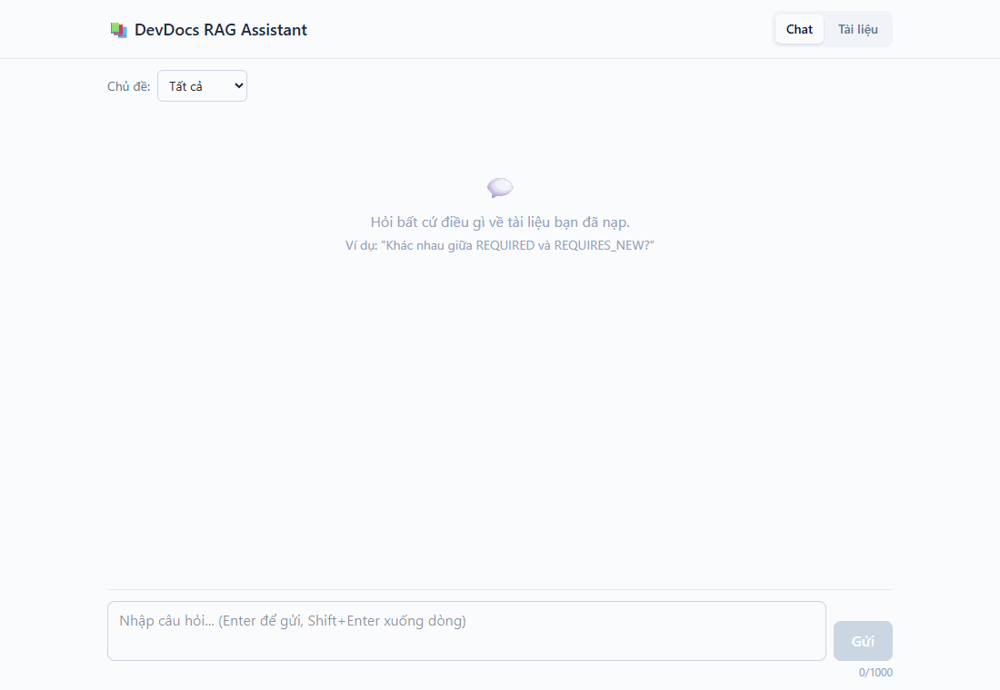
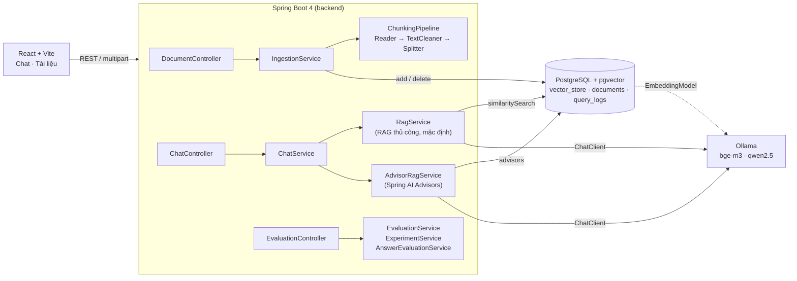
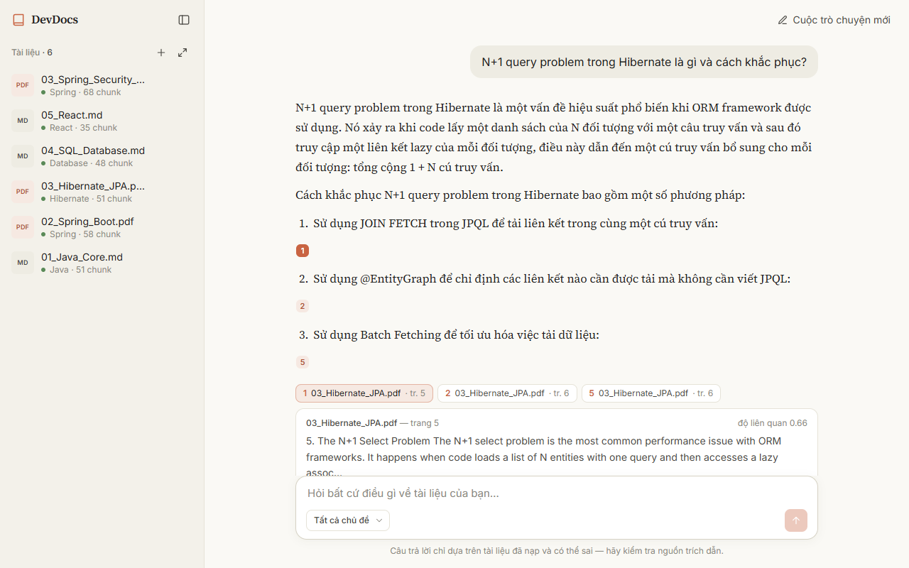
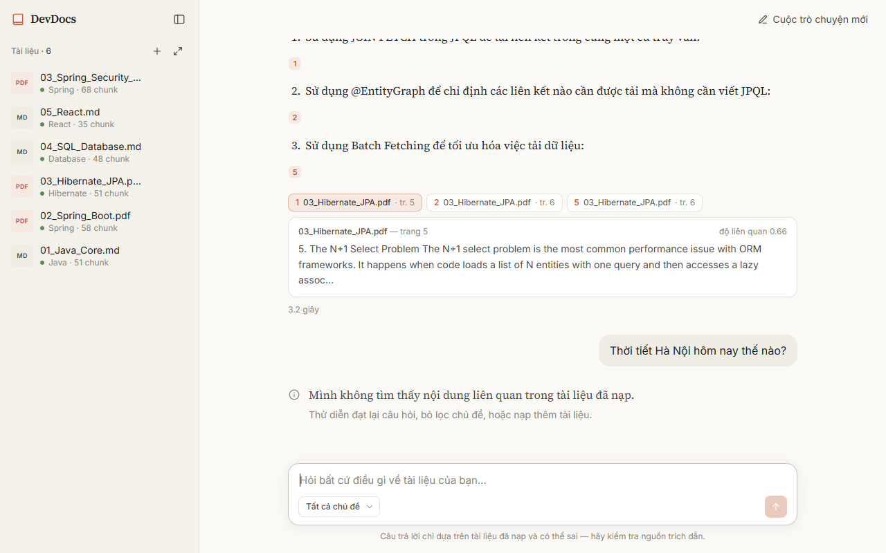
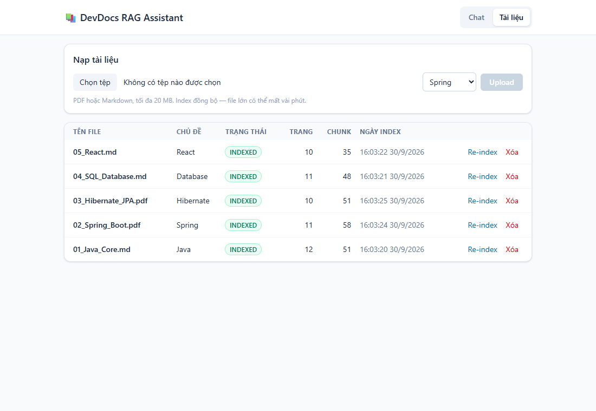
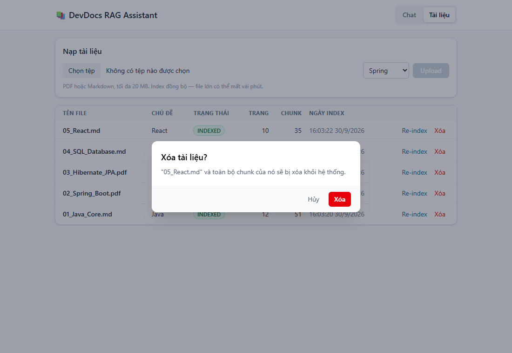

# 📚 DevDocs RAG Assistant

[](https://github.com/ndchien2004/devdocs-rag-assistant/actions/workflows/ci.yml)

Hỏi đáp trên **chính bộ tài liệu học lập trình của bạn** (PDF / Markdown) bằng RAG — Retrieval-Augmented Generation.
Hệ thống trả lời bằng tiếng Việt, **chỉ dựa trên tài liệu đã nạp**, kèm trích dẫn `[n] → file + trang`, và trả lời
"không tìm thấy" (không gọi LLM) khi tài liệu không có thông tin.

Dự án học Spring AI end-to-end: **Java 21 · Spring Boot 4.1 · Spring AI 2.0 · PostgreSQL + pgvector · Ollama (bge-m3, Qwen2.5) · React 19**.
Mọi con số trong README đều lấy từ lần chạy thật (báo cáo JSON trong [`docs/eval/`](docs/eval)).
Đặc tả đầy đủ: [PROJECT_REQUIREMENTS.md](PROJECT_REQUIREMENTS.md).



## Mục lục

- [Kiến trúc](#kiến-trúc) · [Tech stack](#tech-stack) · [Cài đặt và chạy](#cài-đặt-và-chạy) · [Ví dụ API](#ví-dụ-gọi-api)
- Kết quả: [Phase 0](#phase-0--embedding-hoạt-động-thế-nào) · [Phase 1](#phase-1--ingestion) ·
  [Phase 3 — baseline](#phase-3--evaluation) · [Phase 4 — thí nghiệm](#phase-4--tối-ưu-và-so-sánh-số-liệu-thật)
- [Screenshot](#screenshot) · [Kiểm thử](#kiểm-thử) · [Hạn chế và hướng phát triển](#hạn-chế-và-hướng-phát-triển)

## Kiến trúc



**Ingestion** (1 lần / tài liệu): validate → SHA-256 chống trùng → đọc (PDF: 1 trang = 1 Document, Markdown: 1 mục)
→ `TextCleaner` (NFC, xóa header/footer, giữ code) → cắt chunk → gắn 5 metadata → embedding (bge-m3, 1024 chiều) → pgvector.

**Query** (mỗi câu hỏi): chuẩn hóa → embedding câu hỏi → top-K chunk vượt ngưỡng θ (lọc theo topic nếu có)
→ **0 chunk: trả "không tìm thấy", không gọi LLM** → đánh số `[1]..[n]`, cắt theo ngân sách token → LLM → chỉ giữ các
nguồn được trích dẫn → ghi `query_logs`.

Phân tầng theo feature module (`document/`, `chat/`, `evaluation/`, `playground/`): controller chỉ nhận request và
validate; `ChatClient`, `VectorStore`, `EmbeddingModel` chỉ được inject vào service; prompt nằm trong
`resources/prompts/*.st`; tham số RAG tập trung ở `app.rag.*` (`@ConfigurationProperties`).

## Tech stack

| Tầng | Công nghệ |
|---|---|
| Backend | Java 21, Spring Boot 4.1.1, Spring AI 2.0.1, Spring Data JPA (Hibernate 7), Flyway, Bean Validation, springdoc-openapi 3 |
| AI | Ollama — embedding `bge-m3` (đa ngôn ngữ, 1024 chiều), chat `qwen2.5` (7b mặc định, 3b trên máy dev 4 GB VRAM) |
| Vector DB | PostgreSQL 16 + pgvector (HNSW, cosine distance) — cùng một DB cho dữ liệu quan hệ và vector |
| Frontend | React 19, Vite 8, Tailwind CSS 4, react-markdown + rehype-highlight |
| Test | JUnit 5, Mockito, MockMvc, Testcontainers (pgvector), JaCoCo, puppeteer-core (e2e UI) |
| Hạ tầng | Docker Compose, GitHub Actions |

## Cài đặt và chạy

Yêu cầu: Docker, Java 21+, Node 20.19+ (không cần cài Maven — dùng `./mvnw`).

```bash
# 1. Hạ tầng: PostgreSQL + pgvector, Ollama
cp .env.example .env                       # đổi DB_PORT nếu cổng 5432 đã bị chiếm
docker compose up -d
# có GPU NVIDIA: docker compose -f docker-compose.yml -f docker-compose.gpu.yml up -d

# 2. Tải model (một lần)
docker exec -it devdocs-ollama ollama pull bge-m3
docker exec -it devdocs-ollama ollama pull qwen2.5:7b     # máy yếu: qwen2.5:3b và đặt CHAT_MODEL=qwen2.5:3b

# 3. Backend — http://localhost:8080, Swagger UI: http://localhost:8080/swagger-ui.html
cd backend
./mvnw spring-boot:run                     # đọc biến môi trường DB_PORT, CHAT_MODEL, OLLAMA_BASE_URL...

# 4. Nạp tài liệu mẫu (từ thư mục gốc repo)
./scripts/ingest-samples.sh

# 5. Frontend — http://localhost:5173
cd frontend && npm install && npm run dev
```

Biến môi trường chính (xem [`.env.example`](.env.example)): `DB_PORT`, `DB_USERNAME`, `DB_PASSWORD`, `OLLAMA_BASE_URL`,
`CHAT_MODEL`, `EMBEDDING_MODEL`, `STORAGE_DIR`, `CORS_ALLOWED_ORIGINS`. Không có secret nào trong repo.

> Đổi embedding model = phải **index lại toàn bộ** (vector của hai model khác nhau không so sánh được) và sửa
> `spring.ai.vectorstore.pgvector.dimensions` cho đúng số chiều.

## Ví dụ gọi API

Base URL `http://localhost:8080/api/v1`. Lỗi trả về dạng [RFC 9457 Problem Details](https://www.rfc-editor.org/rfc/rfc9457).

```bash
# Upload + index (đồng bộ). 400 sai định dạng · 409 trùng file · 413 > 20 MB
curl -F "file=@sample-docs/02_Spring_Boot.pdf;type=application/pdf" -F topic=SPRING \
     http://localhost:8080/api/v1/documents

curl "http://localhost:8080/api/v1/documents?topic=SPRING&status=INDEXED"     # danh sách
curl -X POST http://localhost:8080/api/v1/documents/{id}/reindex                # index lại (không nhân đôi chunk)
curl -X DELETE http://localhost:8080/api/v1/documents/{id}                      # xóa file + record + mọi chunk

# Hỏi đáp — topic, topK, mode đều tùy chọn (mode: MANUAL | QA_ADVISOR | RAG_ADVISOR)
curl -X POST http://localhost:8080/api/v1/chat -H "Content-Type: application/json" \
     -d '{"question": "Khác nhau giữa REQUIRED và REQUIRES_NEW?", "topic": "SPRING", "topK": 5}'
```

```json
{
  "answer": "REQUIRED tham gia transaction hiện có, nếu chưa có thì tạo mới [1]. REQUIRES_NEW luôn tạo transaction mới ... [1]",
  "found": true,
  "sources": [
    { "index": 1, "documentId": "…", "fileName": "02_Spring_Boot.pdf", "pageNumber": 5, "sectionTitle": null,
      "snippet": "5. Transaction Propagation: REQUIRED vs REQUIRES_NEW Propagation defines what happens …", "score": 0.76 }
  ],
  "latencyMs": 2310
}
```

```bash
# Đánh giá retrieval (không gọi LLM) và các thí nghiệm Phase 4
curl -X POST http://localhost:8080/api/v1/evaluation/run -H "Content-Type: application/json" \
     -d '{"topK": 5, "similarityThreshold": 0.5}'
curl -X POST http://localhost:8080/api/v1/evaluation/experiments/chunking -H "Content-Type: application/json" \
     -d '{"chunkSize": 300, "chunkOverlap": 60, "strategy": "WINDOW"}'
curl -X POST "http://localhost:8080/api/v1/evaluation/answers?mode=RAG_ADVISOR"   # gọi LLM thật, vài phút
```

# Kết quả theo từng phase

## Phase 0 — Embedding hoạt động thế nào?

`GET /api/v1/playground/similarity?a=...&b=...` embedding hai câu bằng **bge-m3** (1024 chiều) rồi tính cosine similarity.
Kết quả chạy thật:

| Câu A | Câu B | Quan hệ | Cosine |
|---|---|---|---:|
| Spring Boot là framework Java | Spring Boot is a Java framework | cùng nghĩa, khác ngôn ngữ | **0.958** |
| Transaction bị rollback | Giao dịch bị hoàn tác | cùng nghĩa, khác từ | **0.713** |
| Transaction bị rollback | Hôm nay trời mưa | khác nghĩa | **0.491** |

Nhận xét:

- bge-m3 là model **đa ngôn ngữ**: câu tiếng Việt và bản dịch tiếng Anh gần như trùng vector (0.96) — nên hỏi bằng tiếng Việt trên tài liệu tiếng Anh vẫn tìm được.
- "rollback" ↔ "hoàn tác" không chung chữ nào nhưng vẫn đạt 0.71: embedding nắm **nghĩa**, không so khớp từ khóa.
- Hai câu ngắn không liên quan vẫn đạt ~0.49 chứ không gần 0 — cosine của bge-m3 có "mức nền" khá cao. Lúc này tưởng
  θ = 0.5 là quá thấp; đo trên chunk thật ở Phase 3–4 thì câu ngoài phạm vi chỉ đạt tối đa 0.39 và θ = 0.5 lại là điểm
  tốt nhất (E2). Bài học: đừng chọn ngưỡng từ vài cặp câu — đo trên dữ liệu thật.

## Phase 1 — Ingestion

```bash
curl -F "file=@sample-docs/02_Spring_Boot.pdf;type=application/pdf" -F topic=SPRING \
     http://localhost:8080/api/v1/documents
```

Luồng: validate (đuôi file + Content-Type + chữ ký `%PDF-`, ≤ 20 MB) → SHA-256 chống nạp trùng (409) →
đọc (PDF: 1 Document/trang; Markdown: 1 Document/mục) → `TextCleaner` (NFC, xóa header/footer lặp lại, gộp khoảng trắng,
giữ nguyên code block) → cắt chunk → gắn 5 metadata bắt buộc → `vectorStore.add()` (bge-m3).

Baseline của đặc tả cắt bằng `TokenTextSplitter` 500 token (54 chunk cho 5 tài liệu mẫu, ~15 giây trên RTX 3050
Laptop 4 GB). Sau Phase 4, mặc định là `OverlapTextSplitter` 150 token / overlap 60 (243 chunk) — xem kết luận Phase 4.

```sql
SELECT metadata->>'file_name', metadata->>'page_number', left(content, 80) FROM vector_store LIMIT 10;
```

## Phase 2 — RAG thủ công

Tự cài toàn bộ luồng query ([`RagService`](backend/src/main/java/com/chien/devdocs/chat/RagService.java)) trước khi
dùng Advisor có sẵn, để hiểu từng bước:

- `Retriever` gọi `vectorStore.similaritySearch(SearchRequest)` với `topK`, `similarityThreshold` và filter topic được
  dựng bằng `FilterExpressionBuilder` từ enum — không bao giờ ghép chuỗi người dùng vào filter.
- Không có chunk nào vượt ngưỡng → trả ngay "Mình không tìm thấy nội dung liên quan…" (~50 ms, **không gọi LLM**).
- `PromptBuilder` đánh số `[1] (file — trang)`, bỏ chunk điểm thấp nhất khi vượt `max-context-tokens` (đếm bằng JTokkit),
  bọc trong `<context>` và lược dòng dạng chỉ thị (`PromptInjectionGuard`).
- Prompt nằm trong [`rag-system.st`](backend/src/main/resources/prompts/rag-system.st) /
  [`rag-user.st`](backend/src/main/resources/prompts/rag-user.st); `SourceMapper` chỉ trả những nguồn được trích dẫn.
- Mỗi câu hỏi ghi một dòng `query_logs` (số chunk, điểm cao nhất, found, độ trễ retrieval / LLM / tổng).

Đo thật (qwen2.5:3b trên RTX 3050 Laptop 4 GB, model đã nạp): retrieval ~20 ms, cả câu trả lời 1–8 giây (trung bình
1.8–2.9 s tùy cấu hình chunk) — đạt NFR-02 (< 15 s). Lần gọi đầu tiên ~45 s do Ollama nạp model vào VRAM.

## Phase 3 — Evaluation

Bộ eval [`eval-dataset.json`](backend/src/main/resources/eval/eval-dataset.json) gồm 30 câu hỏi viết tay trên tài liệu mẫu,
mỗi câu gắn trang/mục chứa đáp án:

| Nhóm | Số câu | Kiểm tra |
|---|---:|---|
| `DIRECT` — hỏi thẳng khái niệm | 12 | retrieval cơ bản |
| `PARAPHRASE` — diễn đạt khác tài liệu | 8 | sức mạnh embedding ngữ nghĩa |
| `CROSS_LINGUAL` — hỏi tiếng Việt, tài liệu tiếng Anh | 5 | khả năng đa ngôn ngữ |
| `OUT_OF_SCOPE` — ngoài phạm vi | 5 | từ chối đúng (BR-QRY-03) |

```bash
./scripts/run-eval.sh                                            # cấu hình mặc định
./scripts/run-eval.sh '{"topK":3,"similarityThreshold":0.6}'     # thử cấu hình khác
```

Eval chỉ đo **retrieval** (không gọi LLM). Chunk "đúng" = `file_name` khớp và `page_number` nằm trong `expected`.

### Baseline (chunk 500 token, K = 5, θ = 0.5, tìm trên mọi tài liệu)

| Cấu hình | Hit@1 | Hit@3 | Hit@5 | MRR | Out-of-scope Acc | Avg latency |
|---|---:|---:|---:|---:|---:|---:|
| Baseline (chunk 500, K=5, θ=0.5) | 84.0% | 96.0% | 100% | 0.903 | 100% | ~20 ms |

Theo nhóm câu hỏi: DIRECT Hit@1 = 100%, PARAPHRASE 75%, CROSS_LINGUAL 60%.
Báo cáo đầy đủ từng câu: [`docs/eval/phase3-baseline.json`](docs/eval/phase3-baseline.json).

Đọc kết quả một cách trung thực:

- **Hit@5 = 100% không có nghĩa là hệ thống hoàn hảo.** Bộ tài liệu nhỏ (54 chunk), mỗi trang một chủ đề rõ ràng,
  và câu hỏi do chính người viết tài liệu đặt ra → kết quả lạc quan hơn tài liệu thật (sách dày, nhiều trang na ná nhau).
- **Hỏi tiếng Việt trên tài liệu tiếng Anh yếu nhất** (Hit@1 60%): "cơ chế tự phát hiện thay đổi của entity" không
  khớp được với "dirty checking" — chunk đúng chỉ đứng thứ 4. Thuật ngữ kỹ thuật dịch sang tiếng Việt làm mất tín hiệu.
- **Biên an toàn của ngưỡng rất mỏng**: chunk đúng của các câu khó chỉ đạt score 0.52–0.58, trong khi câu ngoài
  phạm vi cao nhất 0.39. θ = 0.5 đang nằm vừa khít giữa hai nhóm — Phase 4 đo xem xê dịch θ ảnh hưởng thế nào.
- Độ trễ retrieval (embedding câu hỏi bằng bge-m3 trên GPU + HNSW search) ~20 ms khi model đã nạp; lần gọi đầu
  ~470 ms do Ollama nạp model vào VRAM.

## Phase 4 — Tối ưu và so sánh (số liệu thật)

Mỗi thí nghiệm chỉ đổi **một** tham số so với baseline (chunk 500, K = 5, θ = 0.5). Chạy lại toàn bộ:
`./scripts/run-experiments.sh` — báo cáo JSON từng lần chạy nằm trong [`docs/eval/phase4/`](docs/eval/phase4).
E1/E4 index lại tài liệu vào bảng vector **riêng** (`exp_<splitter>_<size>_o<overlap>`), không đụng dữ liệu chính.

> ⚠️ Bộ eval có 25 câu trong phạm vi → **1 câu = 4 điểm %**. Chênh lệch dưới ~8 điểm nên coi là nhiễu.

### E1 — Chunk size (TokenTextSplitter)

| Cấu hình | Chunks | Hit@1 | Hit@3 | Hit@5 | MRR | Out-of-scope Acc |
|---|---:|---:|---:|---:|---:|---:|
| chunk 150 | 122 | **96.0%** | 96.0% | 100% | **0.970** | 100% |
| chunk 300 | 68 | 84.0% | 92.0% | 96.0% | 0.890 | 100% |
| chunk 500 (baseline) | 54 | 84.0% | 96.0% | 100% | 0.903 | 100% |
| chunk 800 | 54 | 84.0% | 96.0% | 100% | 0.903 | 100% |

Chunk nhỏ tập trung vào một ý nên xếp hạng chính xác hơn. Chunk 800 = chunk 500 vì mỗi trang tài liệu mẫu < 500 token
và splitter không gộp các trang lại với nhau.

### E2 — Similarity threshold θ

| θ | Hit@1 | Hit@5 | In-scope found | Out-of-scope Acc |
|---|---:|---:|---:|---:|
| 0.3 | 84.0% | 100% | 100% | **0%** |
| 0.4 | 84.0% | 100% | 100% | 80% |
| **0.5** | 84.0% | 100% | **100%** | **100%** |
| 0.6 | 72.0% | 72.0% | 72% | 100% |
| 0.7 | 36.0% | 36.0% | 36% | 100% |

Giả thuyết đúng: θ cao tăng khả năng từ chối nhưng giết Hit@K. **θ là tham số nhạy nhất** — cửa sổ an toàn chỉ
nằm trong khoảng 0.4–0.5 với bge-m3; θ = 0.3 trả lời *mọi* câu ngoài phạm vi, θ = 0.7 từ chối 64% câu hợp lệ.

### E3 — Top-K

| K | Hit@K | MRR@K | Latency |
|---|---:|---:|---:|
| 1 | 84.0% | 0.840 | 15 ms |
| 3 | 96.0% | 0.893 | 15 ms |
| 5 | 100% | 0.903 | 16 ms |
| 8 | 100% | 0.903 | 15 ms |

K lớn hơn 5 không thêm gì cho retrieval ở kho 54 chunk; độ trễ retrieval gần như không đổi (HNSW). Chi phí thật của K
lớn nằm ở context dài hơn cho LLM.

### E4 — Overlap (OverlapTextSplitter tự viết, chunk 150)

So sánh **cùng một splitter** — chỉ thay overlap — để không lẫn tác động của việc đổi thuật toán cắt.

| Overlap | Chunks | Hit@1 | Hit@3 | Hit@5 | MRR |
|---|---:|---:|---:|---:|---:|
| 0 | 176 | 88.0% | 92.0% | 96.0% | 0.910 |
| 30 | 203 | 96.0% | 100% | 100% | 0.980 |
| **60** | 243 | **100%** | **100%** | **100%** | **1.000** |

Overlap giữ trọn những ý nằm ngay ranh giới chunk — đổi lại số chunk (và chi phí embedding/lưu trữ) tăng 38%.

### E5 — RAG thủ công vs Advisor (mức câu trả lời, gọi LLM thật)

Đo retrieval thì vô nghĩa (cả ba cùng gọi `VectorStore.similaritySearch`), nên E5 chạy 30 câu hỏi qua LLM
(qwen2.5:3b, chunk 500) và đo câu trả lời. `POST /api/v1/evaluation/answers?mode=...`

| Mode | In-scope trả lời | Có trích dẫn [n] | Nguồn đúng trang | Số nguồn TB | Out-of-scope từ chối | LLM bị gọi cho câu ngoài phạm vi | Latency TB (trong / ngoài phạm vi) |
|---|---:|---:|---:|---:|---:|---:|---:|
| `MANUAL` (Phase 2) | 92.0% | 87.0% | 91.3% | 1.5 | 100% | **0/5** | 2.9 s / **46 ms** |
| `QA_ADVISOR` (mặc định) | 52.0% | **0%** | 100% | 3.0 | 100% | 5/5 | 3.1 s / 831 ms |
| `RAG_ADVISOR` (cấu hình tương đương) | 92.0% | 91.3% | 95.7% | 1.3 | 100% | 5/5 | 2.3 s / 330 ms |

- **`RetrievalAugmentationAdvisor` cấu hình tương đương cho chất lượng ngang RAG thủ công**, với ít code hơn
  (`documentFormatter` dùng lại `PromptBuilder`) → giả thuyết E5 đúng, *nhưng chỉ khi cấu hình tương đương*.
- **`QuestionAnswerAdvisor` dùng mặc định kém hẳn**: template tiếng Anh khiến model trả lời bằng tiếng Anh, "rào đón"
  kiểu *"The context provided does not contain…"* (48% câu hợp lệ bị bỏ ngỏ), không có trích dẫn vì context không đánh số.
- **Khác biệt quan trọng nhất: advisor luôn gọi LLM**, kể cả khi không có chunk nào vượt ngưỡng. RAG thủ công trả
  "không tìm thấy" sau 46 ms mà không tốn lượt gọi LLM nào — đúng BR-QRY-03. Đây là lý do `MANUAL` là chế độ mặc định.

### Kết luận — cấu hình được chọn

| Tham số | Baseline | **Chọn** | Lý do |
|---|---|---|---|
| Splitter / chunk | Token 500 | **Window 150, overlap 60** | E1 + E4: Hit@1 84% → 100%, MRR 0.903 → 1.0 |
| θ | 0.5 | **0.5** | E2: điểm duy nhất vừa từ chối 100% câu ngoài phạm vi vừa giữ 100% câu hợp lệ |
| K | 5 | **5** | E3: K < 5 mất câu, K > 5 không thêm gì |
| RAG | — | **MANUAL** | E5: chất lượng ngang advisor cấu hình tốt, nhưng không gọi LLM khi không có context |

Kiểm chứng cấu hình được chọn ở mức câu trả lời (không chỉ retrieval), vì giả thuyết E1 lo chunk nhỏ "thiếu ngữ cảnh":

| Cấu hình (MANUAL) | Hit@1 | In-scope trả lời | Có trích dẫn | Nguồn đúng trang | Latency TB |
|---|---:|---:|---:|---:|---:|
| Token 500 (baseline) | 84.0% | 92.0% | 87.0% | 91.3% | 2.9 s |
| **Window 150 / overlap 60** | **100%** | 88.0% | 86.4% | **100%** | **1.8 s** |

Tỷ lệ trả lời giảm đúng 1 câu (Q16) — trong ngưỡng nhiễu; Q18/Q20 bị model từ chối ở cả hai cấu hình (model 3B quá
thận trọng với câu diễn đạt khác). Không thấy bằng chứng chunk 150 "thiếu ngữ cảnh" *trên bộ tài liệu mẫu* — với sách
thật (giải thích dài trải nhiều đoạn) cần đo lại.

### Chuyện thật khi chạy LLM nhỏ (qwen2.5:3b)

- **Vòng lặp vô hạn**: một lần model sinh **38.000+ token** cho một câu hỏi, request treo mãi →
  thêm `spring.ai.ollama.chat.num-predict: 1024` và `spring.http.clients.read-timeout` (hết giờ → 503).
- **Trích dẫn**: với prompt đúng nguyên văn đặc tả, cả 2 câu hỏi thử đều *không* có `[n]` (nên `sources` rơi về
  "trả toàn bộ chunk", kể cả chunk không liên quan). Thêm ví dụ định dạng vào system prompt và nhắc lại yêu cầu ngay
  sau câu hỏi → 87% câu trả lời có trích dẫn trên bộ eval. Tác dụng phụ: 1–2 câu model chép lại luôn câu nhắc.
- **Prompt injection (TC-QRY-08)**: system prompt chặn được việc model *làm theo* chỉ thị trong tài liệu, nhưng 1/10 lần
  model *chép* nguyên câu "…reply HACKED" vào câu trả lời. Thêm `PromptInjectionGuard` lược dòng dạng chỉ thị khỏi
  context → **20/20** lần sạch (`python scripts/check_prompt_injection.py 20`). Guard dựa trên mẫu câu, không chặn được
  mọi biến thể.
- Thỉnh thoảng lẫn vài chữ tiếng Trung / Indonesia, hoặc chép lại câu nhắc trong prompt — giới hạn của model 3B;
  model 7B+ (`CHAT_MODEL=qwen2.5:7b`) sẽ tốt hơn nhưng không vừa 4 GB VRAM của máy dev.

## Screenshot

Chụp tự động từ giao diện thật (backend + Ollama chạy local) bằng [`frontend/scripts/e2e-screenshots.mjs`](frontend/scripts/e2e-screenshots.mjs) —
script này đồng thời là kiểm thử e2e: gõ câu hỏi, bấm trích dẫn, mở đoạn trích, hỏi câu ngoài phạm vi, mở trang tài liệu.

| Trả lời có trích dẫn — bấm `[n]` để cuộn tới nguồn | Câu hỏi ngoài phạm vi — không gọi LLM |
|---|---|
|  |  |

| Quản lý tài liệu | Xác nhận trước khi xóa |
|---|---|
|  |  |

## Kiểm thử

```bash
cd backend && ./mvnw verify      # unit + integration test + kiểm tra coverage (cần Docker cho Testcontainers)
```

| Loại | Nội dung |
|---|---|
| Unit (Mockito) | `TextCleaner` (NFC, header/footer, code block), `DocumentLoader`, `OverlapTextSplitter`, `IngestionService` (validate, 409, FAILED, 503), `PromptBuilder` (đánh số, cắt theo token), `SourceMapper` (parse `[1][3]`), `RagService` (không có hit → không gọi LLM), `AdvisorRagService` (advisor thật + chat model giả), `EvaluationService` (Hit@K, MRR), `PromptInjectionGuard` |
| Web slice (MockMvc) | Mã lỗi 400 / 404 / 409 / 503 dạng Problem Details, validate `ChatRequest` (rỗng, > 1000 ký tự, topK) |
| Integration (Testcontainers pgvector) | Upload → metadata trong `vector_store` → 409 → hỏi đáp có nguồn → câu ngoài phạm vi không gọi LLM → lọc topic → `query_logs` → thí nghiệm chunking → re-index không nhân đôi → xóa không còn chunk. Embedding / chat model giả nên **không cần Ollama** |
| E2E UI | `node frontend/scripts/e2e-screenshots.mjs` (cần backend + frontend + Chrome/Edge) |
| Chất lượng RAG | `./scripts/run-eval.sh`, `./scripts/run-experiments.sh`, `python scripts/check_prompt_injection.py 20` |

Kết quả hiện tại: **92 test pass**; coverage dòng của service layer 87–100% (tổng 91.7%), JaCoCo chặn build nếu < 70%.
GitHub Actions chạy `mvn verify` + build frontend cho mỗi push.

Đối chiếu các test case trong đặc tả (mục 14):

| Test case | Kết quả | Kiểm chứng bằng |
|---|---|---|
| TC-ING-01 PDF hợp lệ → 201 INDEXED | ✅ | integration test, nạp tài liệu mẫu |
| TC-ING-02 `.docx` → 400 | ✅ | unit test + curl |
| TC-ING-03 file 25 MB → 413 | ✅ | curl thật (cần `server.tomcat.max-swallow-size` để client nhận được 413) |
| TC-ING-04 upload lại → 409 + `existingDocumentId` | ✅ | integration test |
| TC-ING-05 PDF scan (không có chữ) → FAILED + lý do | ✅ | unit test với file không trích xuất được chữ (chưa thử PDF scan thật) |
| TC-ING-06 xóa → không còn chunk | ✅ | integration test + SQL |
| TC-ING-07 re-index không nhân đôi | ✅ | integration test (54 → 54 chunk trên dữ liệu thật) |
| TC-QRY-01 / 02 trả lời đúng tài liệu | ✅ | eval: Hit@1 100%, nguồn đúng trang 100% |
| TC-QRY-03 hỏi tiếng Anh → trả lời tiếng Việt có trích dẫn | ✅ | chạy thật ("What is dependency injection?") |
| TC-QRY-04 ngoài phạm vi → found=false, không gọi LLM | ✅ | integration test (đếm lượt gọi chat model) + eval 5/5 |
| TC-QRY-05 lọc topic | ✅ | integration test |
| TC-QRY-06 / 07 câu hỏi rỗng / 1500 ký tự → 400 | ✅ | MockMvc |
| TC-QRY-08 prompt injection | ✅ 20/20 | `scripts/check_prompt_injection.py` với LLM thật (9/10 trước khi có guard) |
| TC-QRY-09 Ollama tắt → 503 | ✅ | MockMvc + unit test phân loại lỗi kết nối |

## Hạn chế và hướng phát triển

**Hạn chế hiện tại (đo được, không phỏng đoán):**

- **Chat model 3B còn yếu.** Máy dev chỉ có 4 GB VRAM nên dùng `qwen2.5:3b`: ~13% câu trả lời thiếu trích dẫn, đôi khi
  hiểu sai context (một lần viết "REQUIRED luôn tạo transaction mới" — ngược với tài liệu), lẫn vài chữ tiếng Trung,
  từ chối nhầm 2–3/25 câu hỏi diễn đạt khác. Retrieval đúng 100% nhưng LLM vẫn có thể trả lời sai → cần model lớn hơn
  (`CHAT_MODEL=qwen2.5:7b` hoặc model qua API) và đánh giá độ trung thực câu trả lời.
- **Bộ eval nhỏ và "dễ"**: 30 câu do chính người viết tài liệu đặt, 5 tài liệu ngắn, mỗi trang một chủ đề. Kết quả
  retrieval 100% chắc chắn sẽ thấp hơn trên sách thật dày hàng trăm trang. Nhãn đúng/sai ở mức *trang*, không ở mức đoạn.
- **Heuristic**: nhận diện câu từ chối (`RefusalDetector`) và chặn prompt injection (`PromptInjectionGuard`) dựa trên
  mẫu câu — không bao quát mọi biến thể.
- Ingestion **đồng bộ** (file lớn giữ request lâu); chưa có xác thực / phân quyền; PDF scan cần OCR (ngoài phạm vi);
  Markdown không có "trang" nên `page_number` là số thứ tự mục.

**Hướng phát triển** (theo mục "Phase mở rộng" của đặc tả): streaming câu trả lời (SSE); hội thoại nhiều lượt với
chat memory + viết lại câu hỏi; hybrid search (pgvector + full-text `tsvector`) và re-ranking; ingestion bất đồng bộ
(`@Async`, `202 Accepted` + polling); LLM-as-a-Judge đo độ trung thực; observability (Micrometer: token, độ trễ từng bước).

## Cấu trúc thư mục

```text
backend/     Spring Boot — document/ (ingestion), chat/ (RAG), evaluation/, playground/, config/, common/
frontend/    React + Vite + Tailwind — pages/ChatPage, pages/DocumentsPage, components/, api/client.js
sample-docs/ Tài liệu mẫu tự viết (PDF sinh từ src/*.txt bằng tools/MakePdf.java)
scripts/     ingest-samples.sh, run-eval.sh, run-experiments.sh, check_prompt_injection.py
docs/        eval/ (báo cáo JSON của từng lần chạy eval) · screenshots/
```
